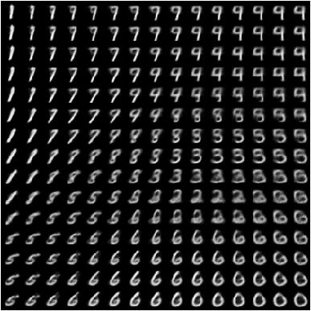
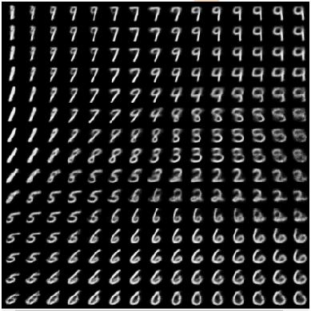
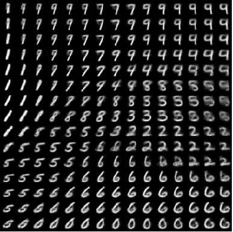
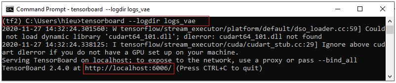
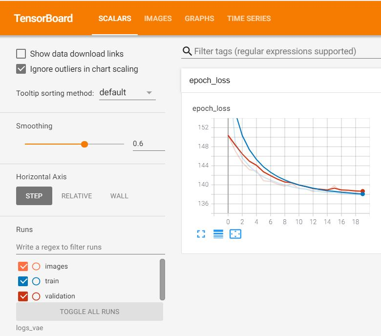
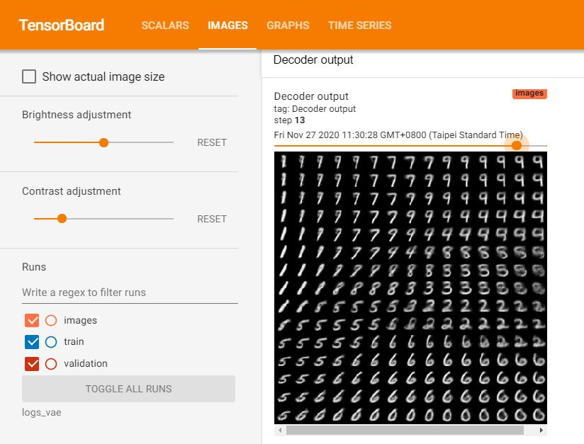

# Lab 10: Variational Auto-Encoder
## Requirements: 
- TensorFlow >= 2.0
- TensorFlow Datasets == 4.1.0

## Training VAE 
train_vae.py

## Test VAE
test_vae.py

## Results
- Epoch 01


- Epoch 10


- Epoch 19


## TensorBoard
- Open log files ("logs_vae" is in  C:\Users\hieu>)
```bash
tensorboard --logdir logs_vae
```


Go to the link http://localhost:6006/ to see the resutl on TensorBoard:
- Training result

- Image result


## References: 
- VAE paper: https://arxiv.org/abs/1312.6114
- https://github.com/KUASWoodyLIN/TF2-WGAN

