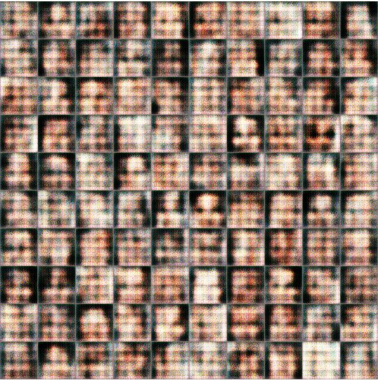
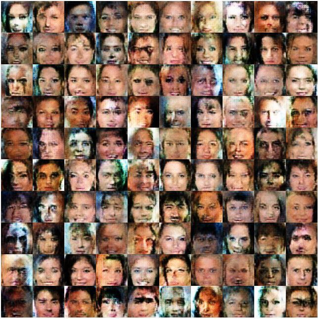
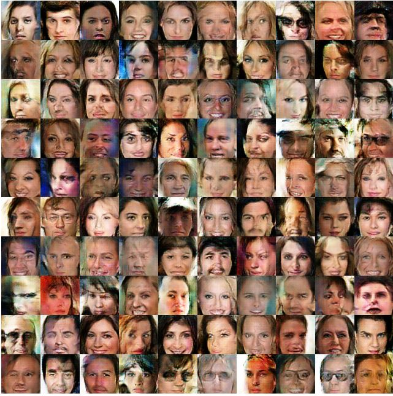
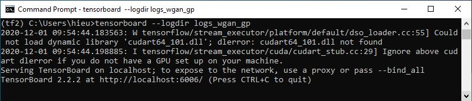
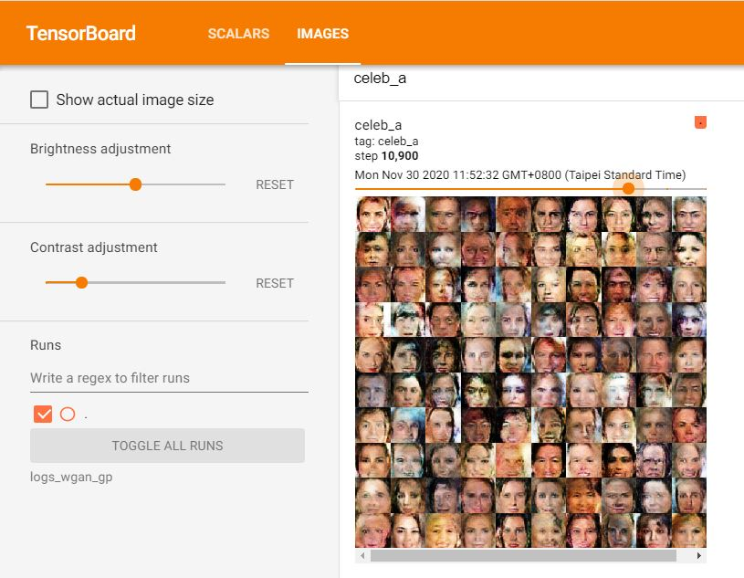

# Lab 11: Generative Adversarial Network

## Usage

- Training GAN 
  - train.py

- Image Results
  - Iteration 100
  

  - Iteration 1000
  

  - Iteration 15800
  

- TensorBoard
  - Open log files ("logs_wgan_gp" is in  C:\Users\hieu>)
  ```bash
  tensorboard --logdir logs_wgan_gp
  ```
  

  Go to the link http://localhost:6006/ to see the resutl on TensorBoard:
  - result
  

- References: 
  - WGAN-GP paper: https://proceedings.neurips.cc/paper/2017/file/892c3b1c6dccd52936e27cbd0ff683d6-Paper.pdf
  - https://github.com/KUASWoodyLIN/TF2-WGAN

